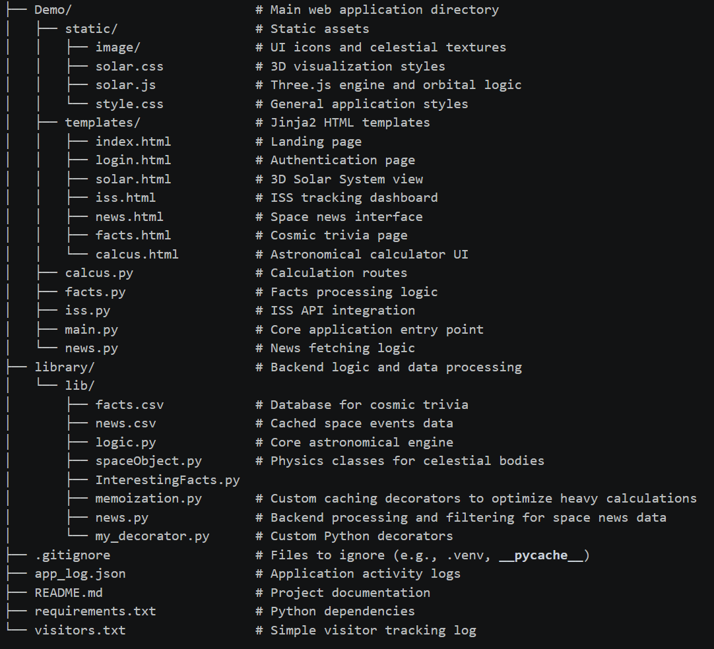
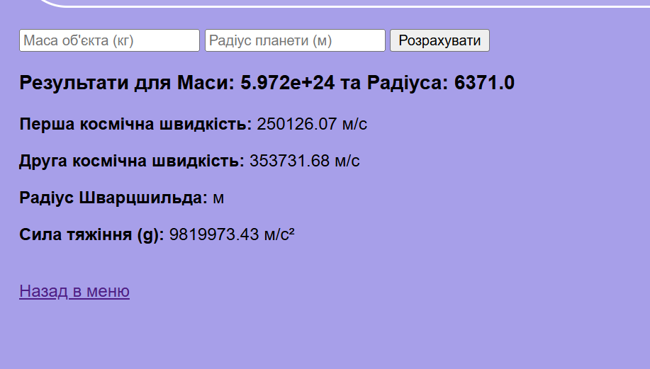

## ✨ Key Features
* 🪐 **3D Orrery:** Interactive Solar System rendered with Three.js.
* 🛰️ **ISS Live Tracker:** Real-time location mapping.
* 📰 **Space News:** Stay updated with cosmic events. News are stored in CSV..
* 🧮 **Astronomical Engine:** Python-based calculations.
* 💾 **Space Facts DB:** Curated database of space facts stored in CSV..

## 🛠️ Tech Stack
* **Backend:** Python 3.10+, Flask
* **Frontend:** Jinja2 Templates, HTML, CSS, JavaScript (Three.js)
* **Database:** CSV file
* **APIs:** NASA Open API, OpenNotify (ISS Tracker)

## 📂 Project Structure

##  Observation
* **🔐 Authentication**

* **🏠 Dashboard & Exploration**

* **🪐 3D Solar System View**

* **🧮 Calculating Tools**

* **Space Facts**

* **🛰️ Tracking & News**

## 🚀 Installation & Setup
* **Clone the repository:**
* git clone [https://github.com/sofiakiosova37-boop/Deno-](https://github.com/sofiakiosova37-boop/Deno-)
cd stellarview
* **Set up virtual environment:**
* python -m venv venv
* Activate (Windows):
venv\Scripts\activate
* Activate (Mac/Linux):
source venv/bin/activate
* **Install dependencies:**
pip install -r requirements.txt
* **Run the app:**
python main.py

## 📜 License
This project is licensed under the MIT License.

