## ✨ Key Features
* 🪐 **3D Orrery:** Interactive Solar System rendered with Three.js.
* 🛰️ **ISS Live Tracker:** Real-time location mapping.
* 📰 **Space News:** Stay updated with cosmic events.
* 🧮 **Astronomical Engine:** Python-based calculations.
* 💾 **Space Facts DB:** Curated database of space facts.

## 🛠️ Tech Stack
* **Backend:** Python 3.10+, Flask
* **Frontend:** Jinja2 Templates, HTML, CSS, JavaScript (Three.js)
* **Database:** CSV file
* **APIs:** NASA Open API, OpenNotify (ISS Tracker)

##  Observation
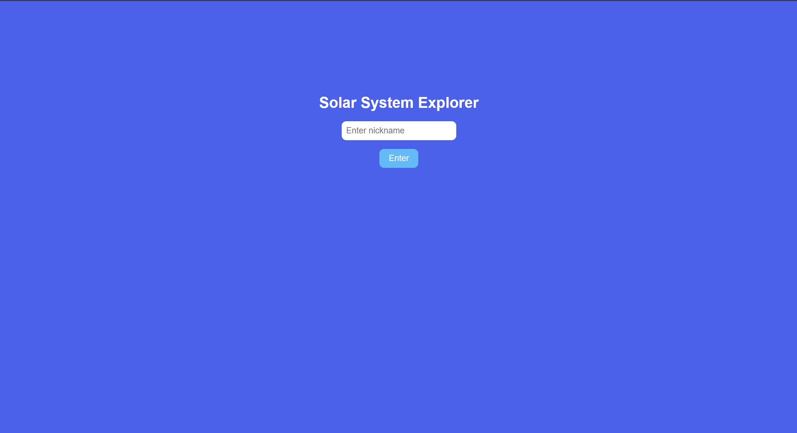
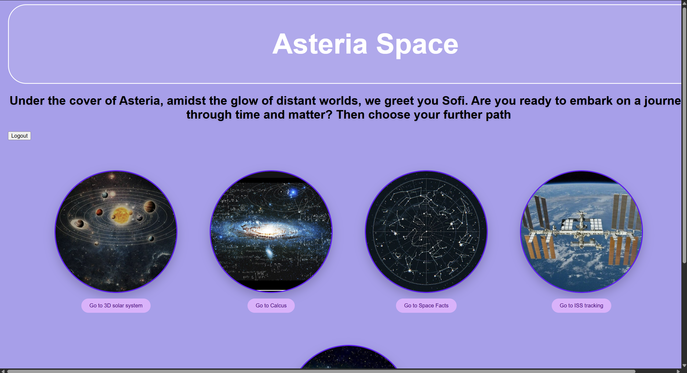
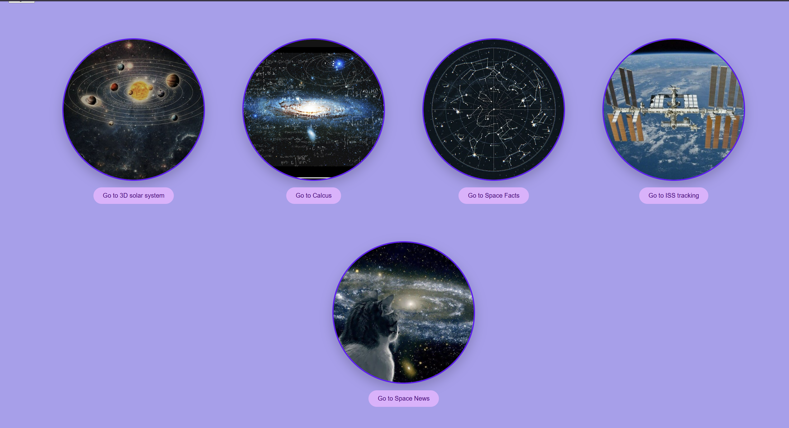
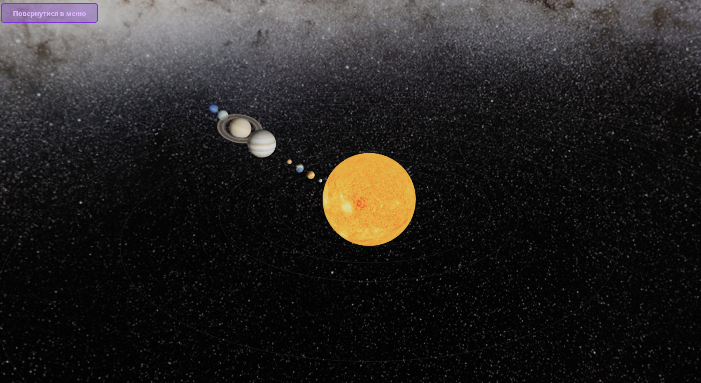
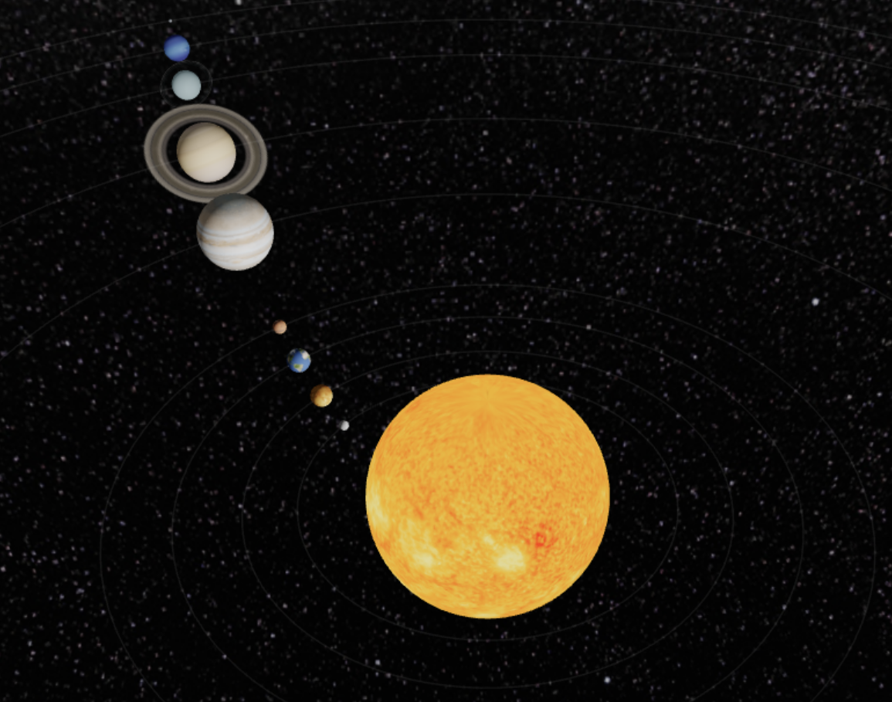
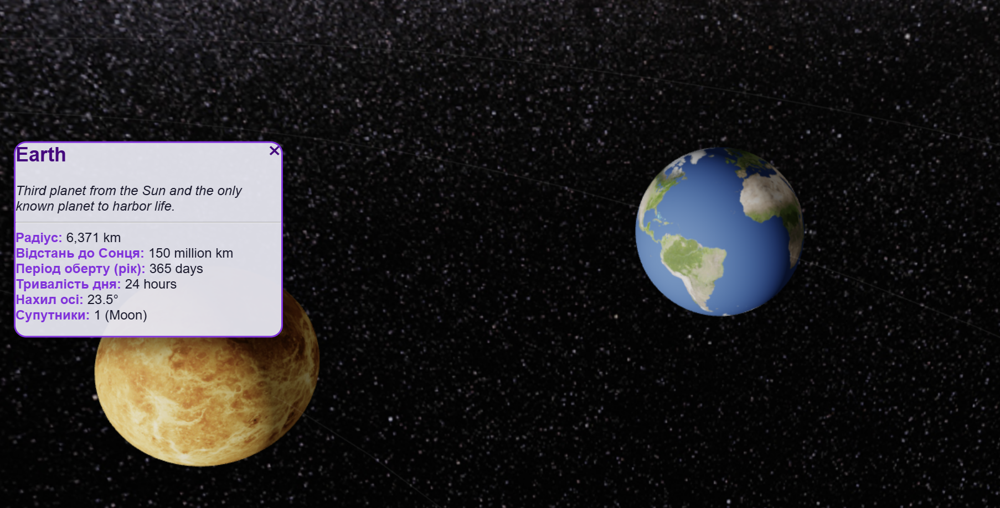
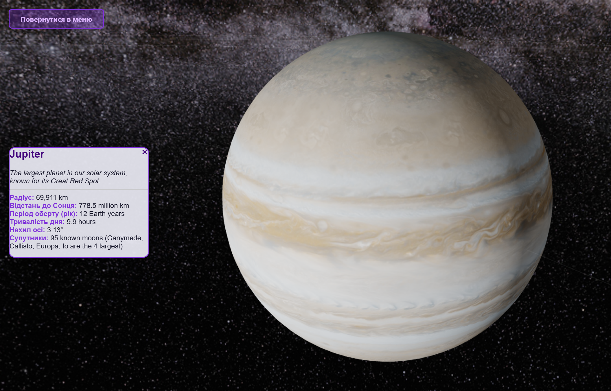
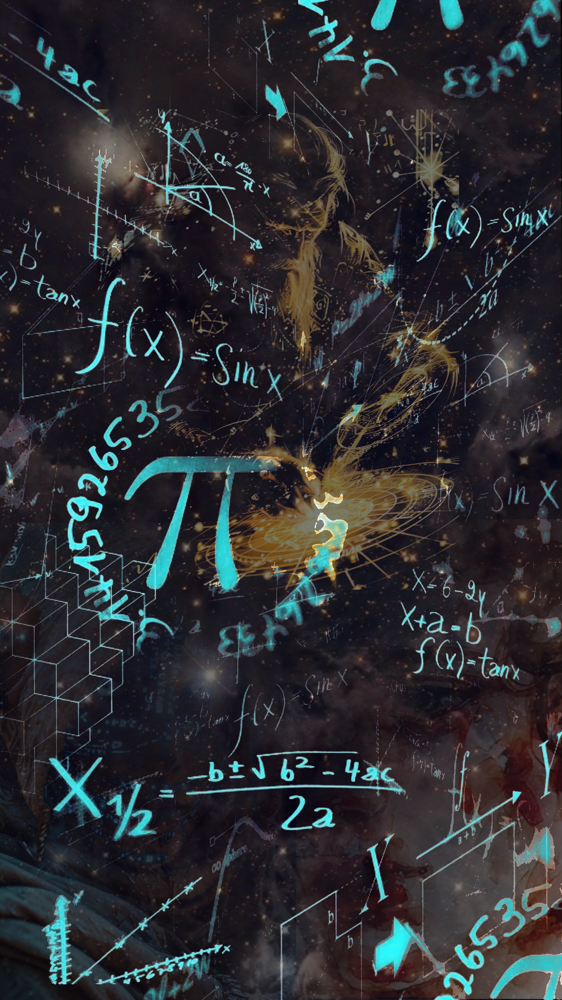
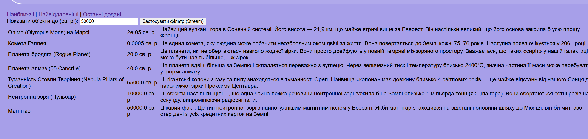
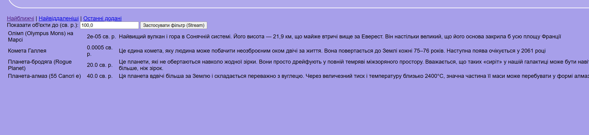
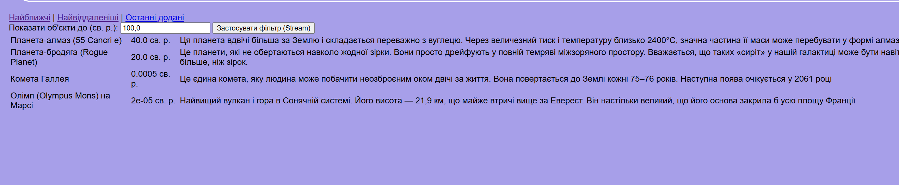
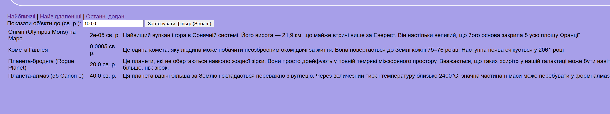
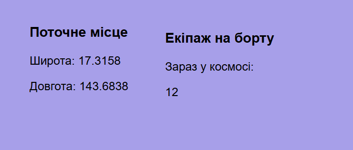
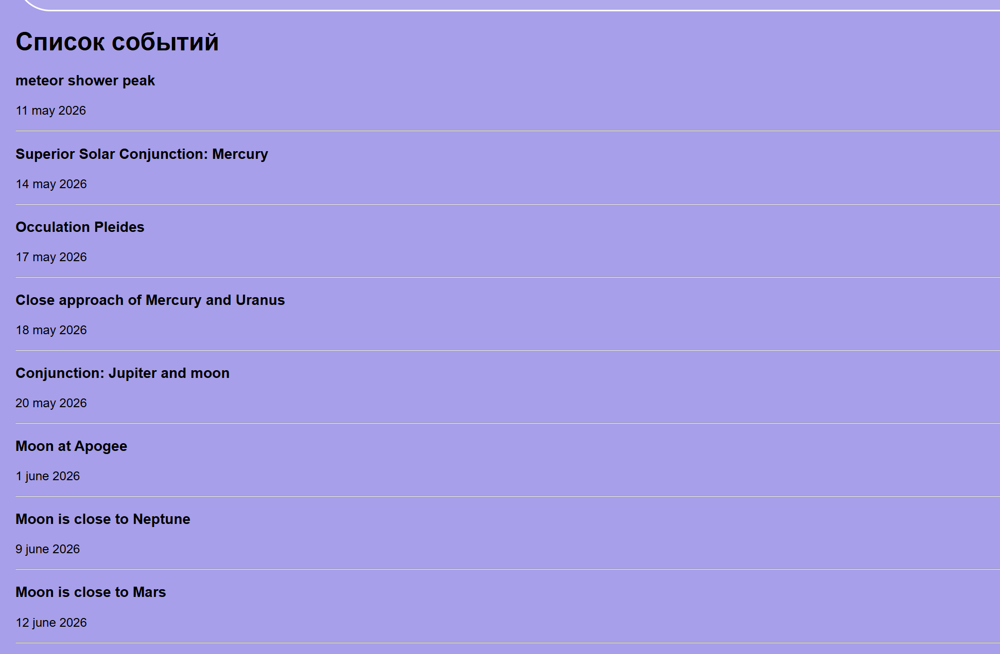

## 📜 License
This project is licensed under the MIT License.

